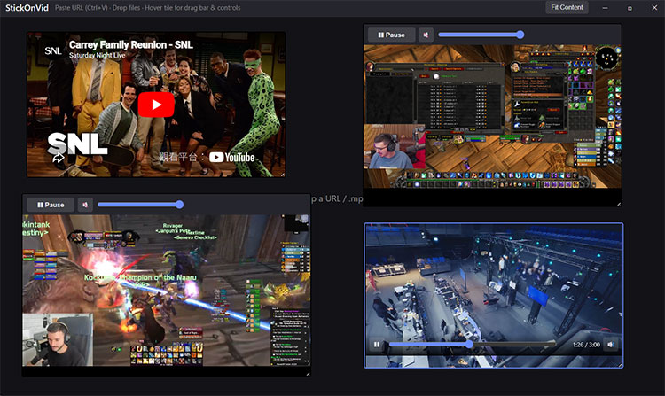

# StickOnVid

A lightweight, **always-on-top** desktop reference player for stacking YouTube, Twitch, and local or remote video on one canvas. Built with [Tauri 2](https://v2.tauri.app/) and the system **WebView2** runtime (no bundled Chromium).

Use it as a floating layout board: VODs, live channels, clips, and `.mp4` / `.webm` files side by side while you work in other apps.



## Features

- **Always on top** — window stays above other apps so your reference tiles stay visible while you work
- **Multi-tile canvas** — up to **4** videos at once (images are unlimited); drag, resize, and arrange freely — tiles can extend past window edges (only the visible portion is shown)
- **Supported sources**
  - YouTube (watch, embed, shorts, `youtu.be`)
  - Twitch (live channel, VOD, clip)
  - Direct **`.mp4` / `.webm`** URLs
  - Local **`.mp4` / `.webm`** files (drag-and-drop or OS file drop)
  - **Reference images** — PNG, JPEG, GIF, WebP, AVIF, HEIC, SVG, TIFF, ICO, and many more (paste, drop, or file path)
- **Frameless window** — auto-hiding title bar (hover the top 34px band), drag from that band, resize from edges and corners (not the top edge); new tiles spawn below the title-bar band; after that, tiles move freely on the canvas
- **Fit Content** — shrink the window to wrap all tiles with padding (**Ctrl+F** or right-click menu)
- **Optimal Align** — resolve overlaps, pack tiles tightly while staying near their original spots, then fit the window (**Ctrl+O** or right-click menu)
- **4-Tiles** — split the current window into a 2×2 grid, resize and move tiles to fit each cell (**Ctrl+T** or right-click menu); images fill remaining cells or stack on the bottom-right when all four slots are videos; playback may pause
- **Mouse wheel resize** — scroll over a tile to scale it (up = larger, down = smaller); no selection required
- **Right-click menu** — Fit Content, Close Video (under pointer), Minimize, Maximize, Quit
- **Session restore** — tile URLs, positions, sizes, and **window size** saved to `localStorage` and restored on reopen (paused; no autoplay)
- **Undo / redo** — layout changes (`Ctrl+Z` / `Shift+Ctrl+Z`, 50 steps); embeds stay mounted when undoing moves/resizes
- **Per-tile controls** — play/pause, seek (where supported), mute, volume; Twitch uses a dedicated bar below the embed

## Requirements

- **Windows 10/11** with [WebView2 Runtime](https://developer.microsoft.com/en-us/microsoft-edge/webview2/)
- [Rust](https://rustup.rs/) (via rustup) — for building from source
- **Node.js 20+** — Tauri CLI and npm scripts

## Development

```bash
npm install
npm run dev
```

After pulling changes that touch Tauri **capabilities** (window resize, Fit Content, etc.), do a **full restart** of `npm run dev` so permissions reload.

Alternative (from `src-tauri/`):

```bash
cargo install tauri-cli --version "^2"
cargo tauri dev
```

## Release build

```bash
npm run build
```

Installer output: `src-tauri/target/release/bundle/nsis/*.exe`

## Quick start

1. Launch StickOnVid (window stays above other apps).
2. **Paste** a URL with **Ctrl+V** (including clipboard screenshots), or **drop** URL text / video / image files onto the canvas.
3. **Hover** the top edge (34px band) to show the title bar (Fit Content, minimize, maximize, close). New tiles start below that band; you can drag them anywhere afterward.
4. **Right-click** the canvas for **Fit Content**, **Optimal Align**, **4-Tiles**, **Close Video** (topmost video under the pointer), **Minimize Window**, **Maximize Window**, or **Quit Program**.
5. **Click** a tile to select it; use that tile’s control bar for playback. Saved **YouTube** tiles show a placeholder until you click or press **Space** when selected.
6. **Drag** tiles by the top strip (YouTube and local video also have a bottom strip on hover). Tiles can be moved **partially off-screen** — only the visible part shows until you drag them back or use **Fit Content**. **Twitch:** drag the control bar below the stream, or the top strip when paused.
7. **Resize** a tile from its corners, or **scroll the mouse wheel** over it (up = larger, down = smaller). **YouTube:** scroll works while playing; **click once** on the video to use YouTube’s in-player controls, then move off the tile to restore wheel resize. **Resize the window** from the left, right, bottom, or bottom corners.

Empty canvas hint: *Paste or drop a URL, video (.mp4 / .webm), or image*

## Keyboard shortcuts

Shortcuts apply when StickOnVid has focus and you are not typing in a control (e.g. seek slider).

| Action | Shortcut |
|--------|----------|
| Paste URL, path, or clipboard image | **Ctrl+V** |
| Undo | **Ctrl+Z** |
| Redo | **Shift+Ctrl+Z** |
| Delete selected tile | **Delete** |
| Resize tile under pointer | **Mouse wheel** over tile (up = larger, down = smaller) |
| Fit window to videos | **Ctrl+F** |
| Pack tiles without overlap and fit window | **Ctrl+O** (Optimal Align) |
| Arrange videos in a 2×2 grid (current window size) | **Ctrl+T** (4-Tiles) |
| Load saved YouTube tile (placeholder) | **Space** (when selected) |
| Twitch play/pause (selected tile) | **Space** |
| GIF play/pause (selected tile) | **Space** |

**Delete** does not run as a global hotkey — another app keeps focus until you click back on StickOnVid.

## Twitch notes

Twitch embeds are more sensitive than YouTube or local files. The app is tuned for that:

- **Play bar below the video** — controls are outside the iframe so they do not block the stream.
- **Lazy load on restore** — saved Twitch tiles show a placeholder until you press **Play** (avoids fingerprint traffic on startup).
- **Start playback** — press **Play** on the bar; if the stream does not start quickly, follow **Click video above** and click once inside the embed (common in embedded players).
- **While playing** — the iframe ignores pointer events so moving the mouse does not pause the stream; use the bar or **Space** to pause. Re-hovering a playing tile after selecting another one resumes playback if Twitch paused spuriously.
- **No overlap** — other tiles cannot be placed on top of a Twitch stream (spatial overlap is prevented on drag, resize, and placement).
- **Above the title bar (z-index)** — Twitch streams render above the hover title bar so autoplay is not interrupted when the bar appears.
- **Minimum size** — about **400×300** for the player plus the control bar (~340px tile height).

Console messages such as `429` on `passport.twitch.tv` / `gql.twitch.tv`, `allowfullscreen` warnings, or Amazon IVS logs usually come from **Twitch’s own scripts**, not StickOnVid. If playback is stuck after heavy dev reloads, wait a few minutes or restart the app. See `twitch_problems01.md` in the repo for a longer troubleshooting write-up.

## YouTube notes

- **Lazy load on restore** — saved YouTube tiles show a placeholder until you **click** it or press **Space** when selected (avoids loading many embeds on startup).
- **Wheel resize while playing** — a transparent shield above the iframe passes scroll events to the app; **click once** on the video to reach YouTube’s own controls, then move the pointer off the tile to restore wheel resize.
- **New URLs** — pasted or dropped YouTube links still load the embed immediately.

## Local video codecs (H.264, H.265)

Local and direct-link files use the HTML5 `<video>` element inside **WebView2** (Chromium on Windows). StickOnVid only checks the **file extension** (`.mp4`, `.webm`); it does not inspect or transcode codecs. Whether a file plays depends entirely on what your system and WebView2 can decode.

| Codec / container | Supported in app? | Playback on Windows |
|-------------------|-------------------|---------------------|
| **H.264 in `.mp4`** | Yes | **Recommended** — usually plays reliably |
| **H.265 / HEVC in `.mp4`** | Yes (same `.mp4` path) | **Best effort** — may work, not guaranteed |
| **VP8 / VP9 in `.webm`** | Yes | Generally good in Chromium |
| **`.mov`** | No | Not accepted (extension filter only) |

### H.264 (AVC)

This is the format to use for reference clips you care about. Exports from phones, editors, and screen recorders labeled “MP4” or “H.264” typically work without extra setup.

### H.265 (HEVC)

Files named `.mp4` that use **H.265 / HEVC** are allowed, but StickOnVid does not treat them as a separate, supported format. Playback often works only when Windows and WebView2 already have HEVC decode available (for example hardware decode on some GPUs, or Microsoft’s [HEVC Video Extensions](https://apps.microsoft.com/detail/9nmzlz57r3t7) for software decode). If decode is missing, you may get a black tile or a “Cannot play video” toast with no in-app fix.

StickOnVid does **not** transcode or remux. For predictable results, re-export problem files as **H.264 `.mp4`** (or `.webm` with VP9) before adding them.

## Reference images

Image tiles use the HTML `` element in **WebView2** (Chromium). Many common and specialty extensions are accepted for import (PNG, JPEG, GIF, WebP, AVIF, HEIC, SVG, PSD, camera RAW, etc.), but **whether a file displays depends on what Chromium can decode** — there is no built-in transcoding or fallback decoder.

| Category | Examples | Typical result in StickOnVid |
|----------|----------|------------------------------|
| **Common** | `.png`, `.jpg`, `.jpeg`, `.gif`, `.webp`, `.bmp`, `.tif` | Usually works; **`.gif` animates** (hover bar: pause/play, **Space**) |
| **Clipboard** | Win+Shift+S screenshot, **Ctrl+V** | Works (bitmap paste) |
| **Modern** | `.avif`, `.heic`, `.heif`, `.jxl` | Best effort — needs OS/WebView2 codecs |
| **Vector / design** | `.svg`, `.psd`, `.exr`, `.dds` | Often fails or rasterizes poorly |
| **Camera RAW** | `.cr2`, `.nef`, `.dng`, … | Usually fails — convert to PNG/JPEG first |

Animated **GIF** tiles loop automatically. Hover the tile for **Play / Pause** (or press **Space** when selected). Local image paths and dropped/pasted images restore across sessions; dropped **video** blobs are session-only.

## Limits and caveats

| Topic | Notes |
|-------|--------|
| **Tile count** | Maximum **4** videos on the canvas; **images do not count** toward that limit |
| **Local codecs** | See [Local video codecs](#local-video-codecs-h264-h265) — H.264 reliable; H.265 best effort |
| **Twitch live** | No reliable timeline seek (platform/API); see [Twitch notes](#twitch-notes) |
| **YouTube** | Requires network; subject to YouTube embed availability; see [YouTube notes](#youtube-notes) |
| **Tile placement** | Drag/resize freely (including off-screen); **Fit Content**, **Optimal Align**, and **4-Tiles** respect the title-bar band and canvas padding |
| **Twitch overlap** | Non-Twitch tiles cannot overlap Twitch streams spatially |
| **Dropped video files** | Blob URLs from drag-and-drop are **session-only** (not restored after quit) |
| **Imported images** | Drop/paste saved as embedded data; file paths and URLs restore normally (large images may exceed storage limits) |
| **Images** | See [Reference images](#reference-images) — wide extension list; decode is Chromium-only |
| **Memory** | Several playing embeds can use ~200–350 MB per tile |
| **Platform** | Windows-focused today (WebView2 + NSIS bundle) |

## Project layout

```
ui/              Web UI (HTML, CSS, app logic, URL parsing)
src-tauri/       Rust/Tauri shell, capabilities, bundling
scripts/         npm helpers for Tauri CLI
```

## License

See repository license file if present; otherwise treat as private/unlicensed until specified.
